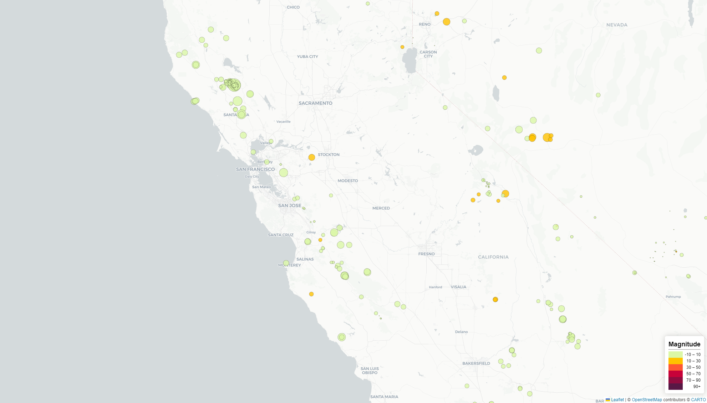
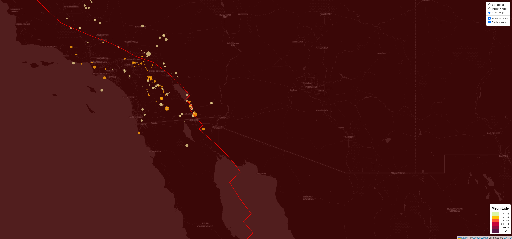

# leaflet-challenge
Module 15 Challenge - Develop a new set of tools that allow for the visualization to help educate the public and other government organizations of the earthquake data obtained by <a href="https://earthquake.usgs.gov/earthquakes/feed/v1.0/geojson.php" target="_blank">United States Geological Survey (USGS)</a> each day.

## Data Source
For this particular challenge, the <a href="https://earthquake.usgs.gov/earthquakes/feed/v1.0/geojson.php" target="_blank">past 7 days - all earthquake</a> data were used to create the visualization of the earthquakes that occurred throughout the world. The visualization was split into two parts below.

## PART I - Create the Earthquake Visualization

In this part, the earthquakes were visualized using circle markers where the size depends on the magnitude of the earthquake and color tone being the depth of the earthquake (the greater the darker tone) data with a legend showing the range of the depth. Each data point will also include a popup with information of about the earthquake.

To view this visualization, navigate to the <a href="https://github.com/123noob1/leaflet-challenge/tree/main/leaflet-part-1">leaflet-part-1</a> folder and run the <code>index.html</code> file. The data will change based on the current live data obtained from USGS.

## PART II - Gather and Plot More Data (Optional)

In addition to the dataset and visual from <code>PART I</code>, plot an additional layer to include the tectonic plates (data obtained from <a href="https://github.com/fraxen/tectonicplates/blob/master/GeoJSON/PB2002_plates.json" target="_blank">here</a>) to illustrate the relationship between tectonic plates and seismic activity. Additional base maps were included to help enhance the visualization as well.

To view this visualization, navigate to the <a href="https://github.com/123noob1/leaflet-challenge/tree/main/leaflet-part-2">leaflet-part-1</a> folder and run the <code>index.html</code> file. The data will change based on the current live data obtained from USGS.

## References
Leaflet base maps used: <a href="https://www.openstreetmap.org/copyright" target="_blank">OpenStreetMap</a> and <a href="https://carto.com/attributions" target="_blank">CARTO</a>
